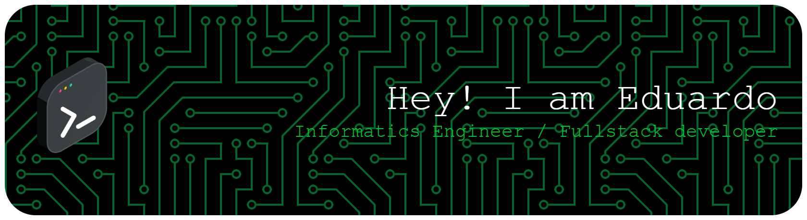

---

## [🇺🇸 English](#english) | [🇨🇱 Español](#español)

---

## English

<h1 align="center">Hello! I'm Eduardo 👋</h1>

### About me

🚀 **Software Engineer** passionate about building impactful digital products with **3 years of experience** in Full Stack Development. I thrive at the intersection of **Backend Excellence** (Python/Django, Node.js/NestJS), **Frontend Innovation** (React, Next.js), and **DevOps Engineering**. 

🎯 Currently exploring the cutting edge of **AI integration** and **Cloud Architecture**, transforming ideas into scalable solutions that make a difference. When I'm not coding, you'll find me diving deep into new technologies or optimizing deployment pipelines!

---

### 🚀 Featured Projects

-  **🏥 Rotativa Myra** - [View Project](#)  
  HR System for healthcare company, automating professional payment calculations. Built with Django + React + Tailwind CSS.

-  **🤖 PoC AI Detector** - [View Project](#)  
  AI-generated text detector. Tech stack: Django + NestJS + React.js + Tailwind CSS + HuggingFace

-  **🎙️ Textifying Speaking** - [View Project](#)  
  Video and audio transcription prototype for content accessibility.

-  **☁️ Point Cloud Prototype** - [View Project](#)  
  Technical prototype for 3D point cloud processing and mesh reconstruction.

*Live demos coming soon ✨*

---

### 🛠️ Tech Stack

- **Programming languages**: Python · JavaScript · TypeScript · Java · PHP · C
- **Backend**: Django · Node.js · NestJS · Spring Boot
- **Frontend**: React.js · Next.js · Tailwind CSS
- **BBDD**: PostgreSQL · MongoDB
- **Testing**: JMeter · SonarQube · Trivy · Vitest · Pytest · JUnit · Selenium
- **DevOps**: Docker · GitHub Actions · Jenkins · Nginx · Terraform · Ansible · Kubernetes · Prometheus · Grafana
- **Cloud Computing**: Microsoft Azure · GCP · Vercel · Heroku · AWS
- **IA / ML**: Hugging Face · Transformers · Jupyter Notebook · OpenAI API
- **Other**: Git · GitHub · Linux · Bash · Figma · JIRA · Agile/Scrum · Vite · Makefile

---

### 📈 GitHub Analytics

---

### 🎯 Looking for Opportunities

I'm actively seeking my **first formal role in IT** as a **Trainee DevOps Engineer**, **Jr Full Stack Developer**, or **Jr Backend Developer**. Open to both **remote** and **on-site** opportunities (Santiago, Chile). 

**Let's build something amazing together!** 🚀

---

## Español

<h1 align="center">¡Hola! Soy Eduardo 👋</h1>

### Acerca de mí

🚀 **Ingeniero en Software** apasionado por construir productos digitales de impacto con **3 años de experiencia** en Desarrollo Full Stack. Me desempeño en la intersección entre **Excelencia Backend** (Python/Django, Node.js/NestJS), **Innovación Frontend** (React, Next.js), e **Ingeniería DevOps**.

🎯 Actualmente explorando la vanguardia de **integración de IA** y **Arquitectura Cloud**, transformando ideas en soluciones escalables que marcan la diferencia. Cuando no estoy programando, me encontrarás sumergiéndome en nuevas tecnologías u optimizando pipelines de despliegue!

---

### � Proyectos Destacados

-  **🏥 Rotativa Myra** - [Ver Proyecto](#)  
  Sistema de RRHH para empresa de salud, automatizando el cálculo de pagos a profesionales. Construido con Django + React + Tailwind CSS.

-  **🤖 PoC AI Detector** - [Ver Proyecto](#)  
  Detector de texto generado por IA. Stack tecnológico: Django + NestJS + React.js + Tailwind CSS + HuggingFace

-  **🎙️ Textifying Speaking** - [Ver Proyecto](#)  
  Prototipo de transcripción de videos y audios para accesibilidad de contenido.

-  **☁️ Point Cloud Prototype** - [Ver Proyecto](#)  
  Prototipo técnico para procesamiento de nubes de puntos 3D y reconstrucción de mallas.

*Demos en vivo próximamente ✨*

---

### 🛠️ Stack tecnológico
- **Lenguajes de programación:** Python · JavaScript · TypeScript · Java · PHP · C
- **Backend**: Django · Node.js · NestJS · Spring Boot
- **Frontend**: React.js · Next.js · Tailwind CSS
- **BBDD**: PostgreSQL · MongoDB
- **Testing**: JMeter · SonarQube · Trivy · Vitest · Pytest · JUnit · Selenium
- **DevOps**: Docker · GitHub Actions · Jenkins · Nginx · Terraform · Ansible · Kubernetes · Prometheus · Grafana
- **Cloud Computing**: Microsoft Azure · GCP · Vercel · Heroku · AWS
- **IA / ML**: Hugging Face · Transformers · Jupyter Notebook · OpenAI API
- **Otros**: Git · GitHub · Linux · Bash · Figma · JIRA · Agile/Scrum · Vite · Makefile

---

### 🎯 Buscando Oportunidades

Estoy activamente buscando mi **primer rol formal en IT** como **Trainee DevOps Engineer**, **Jr Full Stack Developer**, o **Jr Backend Developer**. Abierto tanto a oportunidades **remotas** como **presenciales** (Santiago, Chile).

**¡Construyamos algo increíble juntos!** 🚀

---

> Este README está en constante evolución, al igual que yo. ¡Gracias por visitar mi perfil! 🚀

